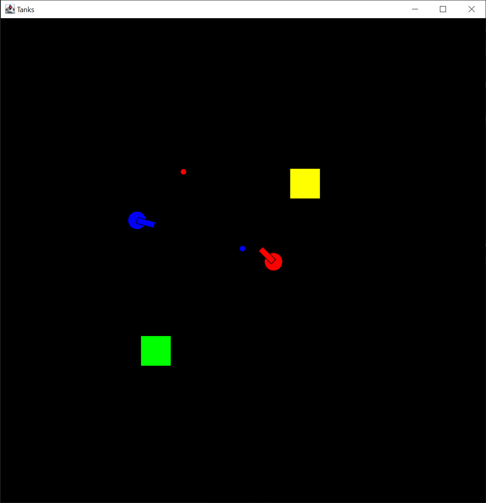

# Tanks!
By Wheaton Gribb and Wyatt Petersen

## Required Software
- OpenJDK version 25.0.2
- VS code version 1.118.1
- Kilt Graphics 1.10

## Rules + Format
Tanks! is a 2 player local PvP game played on one keyboard. The goal of the game is to eliminate the other player by shooting their tank.

Each round will begin with each tank in opposite corners. Obstacles that block tank movement and bullets will be randomly generated around the screen.
The players will then be given control, with the goal of eliminating the other player. Tanks will automatically fire slow moving bullets, but you can only have one bullet out at a time, so be careful!
When a player is eliminated, the other player gains a point and the round resets, generating new obstacles. The game is played with a lives format, each player starts with 3 and loses one when eliminated. 
The first player to run out of lives loses!

## Controls

### For Player 1 (Blue Tank)
- W - Drive Forward
- S - Drive Backward
- A - Turn Left
- D - Turn Right

### For Player 2 (Red Tank)
- UP ARROW - Drive Forward
- DONW ARROW - Drive Backward
- LEFT ARROW - Turn Left
- RIGHT ARROW - Turn Right

## Instructions to Play
1. Open project in VS code
2. Run `MainWindow` (Insure proper functionality of KiltGrahpics ahead of time)
3. Position players on keyboard. As stated above, one player will use WASD while another will use the arrow keys.
4. Play until one player wins!
5. Repeat if desired

## Images

*More images to be added in the future*

## Known Bugs/Limitations

*To be added in the future*

## Resources
- Wii Play Tanks - This was the main inspiration behind our game. It is worth noting that this is a 1-2 player Co-op campaign format instead of PvP. Gameplay can be found [here](https://youtu.be/orLxrg51xL8).
- Diep.io - A browser game that inspired the artstyle (If you could call it that) of our game. The game can be found [here](https://diep.io).
- Fireboy and Watergirl - This inspired the control scheme. This game was always fun in school because it was basically the only Co-op game on flash that I can recall. The game can be found [here](https://www.coolmathgames.com/0-fireboy-and-water-girl-in-the-forest-temple). 
- Kilt Graphics Documentation - It helped, but not as much as we'd like it to! It can be found [here](https://mac-comp127.github.io/kilt-graphics/).

Thank you for checking out our project!